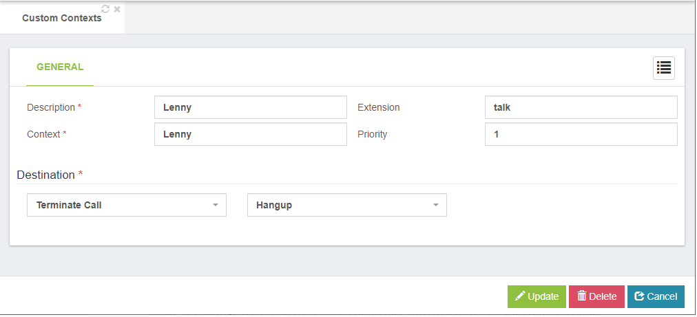
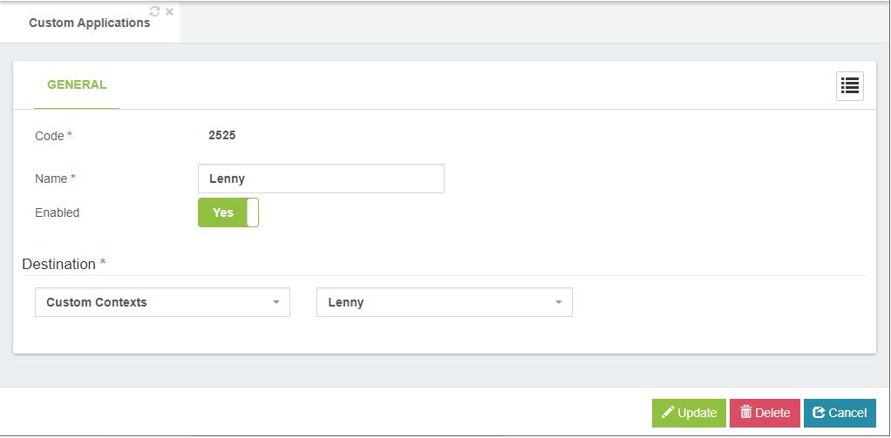

# Telemarketers with Lenny
Telemarketers are the worst. They have no souls. They feed off of the misery of others. No one likes them. Luckily, a nice British gentleman by the name of Lenny has come to save the day.

Setting up Lenny in VitalPBX is a pretty simple task, and is also a really nice primer into Asterisk custom contexts, and the power of scripting.

First, you will want to create the Lenny custom context in Asterisk. SSH into your FreePBX and use your favorite editor to edit /etc/asterisk/extensions_custom.conf. Add the following lines of code

First, you will want to create the Lenny context in Asterisk. SSH into your VitalPBX and use your favorite editor to edit /etc/asterisk/ombutel/extensions__80_lenny.conf. Add the following lines of code:

<pre>
vi /etc/asterisk/ombutel/extensions__80_lenny.conf

[Lenny]
exten => talk,1,Set(i=${IF($["0${i}"="016"]?7:$[0${i}+1])})
same => n,ExecIf($[${i}=1]?MixMonitor(${UNIQUEID}.wav))
same => n,Playback(Lenny/Lenny${i})
same => n,BackgroundDetect(Lenny/backgroundnoise,1500)
</pre>

Next, use WinSCP to copy the Lenny sound files into /var/lib/asterisk/sounds/Lenny
(you may have to create the /Lenny directory).

Now create a Custom Context in VitalPBX for which you have to go to PBX/Applications/Custom Contexs. It has to be seen as shown below

Then create a Custom Application in VitalPBX for which you have to go to PBX/Applications/Custom Applications. It has to be seen as shown below

Finally apply changes and call 2525 and try to sell something to Lenny.

We hope you enjoy it.

Source of information:
[Crosstalk Solutions](https://crosstalksolutions.com/howto-pwn-telemarketers-with-lenny/)
